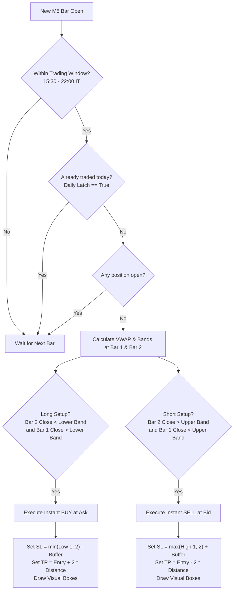

# 📊 VWAP-MR-NQ5: Quantitative Mean Reversion Expert Advisor

<p align="center">
  
  
  
  
  
  
</p>

---

## 📌 Overview

**VWAP-MR-NQ5** is an institutional-grade, algorithmic Mean Reversion Expert Advisor (EA) developed natively for **MetaTrader 5 (MQL5)** and synchronized with **TradingView (Pine Script v6)**. 

Designed specifically for the **NASDAQ 100 CFD** (`US100`, `NAS100`, `USTEC`), the strategy exploits statistical deviations away from the **Session-Anchored Volume-Weighted Average Price (VWAP)** using standard deviation bands ($\pm 1.5\sigma$) with exact mathematical parity to TradingView.

---

## ⚡ Key Highlights

- 🎯 **Strict Bar-Close Execution (Zero Repainting):** Entry signals are evaluated strictly on closed bars (`Bar[1]` and `Bar[2]`) at the very first tick of a newly formed M5 bar (`Bar[0]`).
- 📐 **Full TradingView Indicator Parity:** Built with a custom single-pass cumulative accumulator matching TradingView's built-in VWAP (`Source = Open`, `Anchor = Session / D1`, `Multiplier = 1.5`).
- 🛡️ **Institutional Risk Management:**
  - Dynamic lot sizing based on account equity/balance percentage (`RiskPercent = 1.0%`).
  - Native Hard Stop Loss (SL) and Take Profit (TP) sent directly to broker servers.
  - Asymmetrical **1:2 Risk-to-Reward Ratio (R:R)** on all setups.
  - Automatic **Break-Even (BE)** adjustment once price reaches **1:1 R:R**.
  - **Strict Daily Limit:** Maximum 1 trade per calendar day to avoid overtrading.
- 🕒 **Session & Timezone Engine:**
  - Automated translation between Broker Server GMT and Italian Local Time (CET/CEST).
  - Trading trigger window strictly restricted to **15:30 – 22:00 Italian Time** (US Cash Equity Session).
  - **EOD Hard Close:** Automatic liquidation of open positions at 22:00 IT to prevent overnight gap risks.
- 🖥️ **Interactive On-Chart GUI:**
  - **HUD (Top-Left):** Real-time session status, trade latch status, and live computed VWAP & Band values.
  - **Strategy Rules Panel (Top-Right):** Quick-reference card displayed directly on the MT5 chart.
  - **TV-Style Visual Trade Boxes:** Semi-transparent green (TP) and red (SL) rectangles drawn upon order execution and dynamically adjusted on Break-Even.

---

## 🧠 Strategy Logic & Mathematical Engine

### 1. VWAP Mathematical Formulation

The engine accumulates tick volume and price data starting from the midnight server reset (`00:00` D1 open):

$$\text{Price Source } (P_i) = \text{Open}_i$$

$$\text{CumVol} = \sum_{i=start}^{1} \text{Volume}_i \quad\quad \text{CumPV} = \sum_{i=start}^{1} (P_i \times \text{Volume}_i) \quad\quad \text{CumP2V} = \sum_{i=start}^{1} (P_i^2 \times \text{Volume}_i)$$

$$\text{VWAP} = \frac{\text{CumPV}}{\text{CumVol}}$$

$$\text{Variance} = \frac{\text{CumP2V}}{\text{CumVol}} - \text{VWAP}^2 \quad\implies\quad \text{StdDev} = \sqrt{\max(0.0, \text{Variance})}$$

$$\text{Upper Band} = \text{VWAP} + (1.5 \times \text{StdDev})$$
$$\text{Lower Band} = \text{VWAP} - (1.5 \times \text{StdDev})$$

---

### 2. Entry Conditions



#### 🟢 Long Setup (Reversion from Lower Band)
1. **Breakout Condition:** Bar 2 closes strictly below the Lower Band:
   $$\text{Close}[2] < \text{LowerBand}[2]$$
2. **Re-entry Confirmation:** Bar 1 closes back inside above the Lower Band:
   $$\text{Close}[1] > \text{LowerBand}[1]$$
3. **Execution:** Market BUY order placed at current `Ask` at the open of `Bar[0]`.
4. **Stop Loss (SL):** Lowest low of Bar 1 and Bar 2, minus a small spread buffer:
   $$\text{SL} = \min(\text{Low}[1], \text{Low}[2]) - \text{Buffer}$$
5. **Take Profit (TP):** Fixed 1:2 R:R target:
   $$\text{TP} = \text{Entry} + 2.0 \times (\text{Entry} - \text{SL})$$

---

#### 🔴 Short Setup (Reversion from Upper Band)
1. **Breakout Condition:** Bar 2 closes strictly above the Upper Band:
   $$\text{Close}[2] > \text{UpperBand}[2]$$
2. **Re-entry Confirmation:** Bar 1 closes back inside below the Upper Band:
   $$\text{Close}[1] < \text{UpperBand}[1]$$
3. **Execution:** Market SELL order placed at current `Bid` at the open of `Bar[0]`.
4. **Stop Loss (SL):** Highest high of Bar 1 and Bar 2, plus a small spread buffer:
   $$\text{SL} = \max(\text{High}[1], \text{High}[2]) + \text{Buffer}$$
5. **Take Profit (TP):** Fixed 1:2 R:R target:
   $$\text{TP} = \text{Entry} - 2.0 \times (\text{SL} - \text{Entry})$$

---

### 3. Trade Management & Protective Exits

| Mechanism | Trigger Level | Action | Frequency |
|---|---|---|---|
| **Break-Even (BE)** | Floating profit reaches **1:1 R:R** | Adjusts Stop Loss to `EntryPrice + Buffer` | Evaluated tick-by-tick |
| **Max Frequency** | 1 filled order confirmed | Locks daily latch `m_tradeTakenToday = true` | Reset at `00:00` next session |
| **EOD Hard Close** | Server time reaches **22:00 Italian Time** | Liquidates open position immediately at market | Evaluated tick-by-tick |
| **Visual Rectangles** | Position opened / modified | Updates chart TP/SL boxes; cleans up on close | Auto-synced |

---

## 📁 Repository Structure

```
VWAP-MR-NQ5/
├── VWAP-MR-NQ5.mq5         # Core Expert Advisor source code (MQL5)
├── TW-Indicator/
│   └── VWAP.pine           # Companion TradingView indicator (Pine Script v6)
├── spec.md                 # Full architectural & mathematical specification
└── README.md               # Documentation & quick start guide
```

---

## ⚙️ Input Parameters

```cpp
//=== Session Settings ===
input int    InpBrokerGMTOffset  = 3;      // Broker Server GMT Offset (e.g., GMT+3 in summer)
input int    InpItalianGMTOffset = 2;      // Italian GMT Offset (2=CEST summer, 1=CET winter)
input int    InpSessionStartHour = 15;     // Session Start Hour (Italian Time)
input int    InpSessionStartMin  = 30;     // Session Start Minute (15:30 IT = US Open)
input int    InpSessionEndHour   = 22;     // Session End Hour (Italian Time)
input int    InpSessionEndMin    = 0;      // Session End Minute (22:00 IT = Hard Close)

//=== Risk Management ===
input double InpRiskPercent      = 1.0;    // Risk Per Trade (% of Account Balance)
input int    InpMagicNumber      = 100001; // EA Unique Magic Number
```

---

## 🚀 Installation & Quick Start

### 1. MetaTrader 5 (MQL5) Setup

1. Open **MetaTrader 5**.
2. Press `F4` or navigate to **Tools > MetaQuotes Language Editor** to open **MetaEditor**.
3. In the MetaEditor *Navigator* panel, expand `MQL5` and right-click on `Experts` > **Open Folder**.
4. Copy `VWAP-MR-NQ5.mq5` into your `MQL5/Experts/` folder.
5. Open `VWAP-MR-NQ5.mq5` in MetaEditor and click **Compile** (`F7`). Verify that compilation completes with **0 errors and 0 warnings**.
6. Return to MT5, open an **M5 chart** for **NAS100 / US100**.
7. In the MT5 *Navigator* panel (`Ctrl+N`), find **VWAP-MR-NQ5** under *Expert Advisors*, and drag it onto the chart.
8. In the dialog box:
   - Check **"Allow Algo Trading"**.
   - Check your broker's GMT offset in the **Inputs** tab (most European brokers are `GMT+2` winter, `GMT+3` summer).
9. Ensure the global **Algo Trading** button on the MT5 top toolbar is turned **ON** (Green).

### 2. TradingView Setup (Pine Script v6)

1. Open [TradingView](https://www.tradingview.com) and navigate to the `NDX` or `NQ1!` M5 chart.
2. Click on the **Pine Editor** tab at the bottom of the screen.
3. Open `TW-Indicator/VWAP.pine` from this repo, copy all code, and paste it into the editor.
4. Click **Save** and **Add to chart**.
5. In the indicator settings:
   - **Source:** Set to `Open`
   - **Anchor:** `Session`
   - **Band Multiplier #1:** `1.5`

---

## 🎨 Visual Interface Preview

When running on chart, **VWAP-MR-NQ5** renders a clean institutional interface:

1. **Dashboard HUD (Top-Left):**
   ```
   [VWAP-MR-NQ5 v1.10]
   Session: ACTIVE (15:30 - 22:00 IT)
   Daily Trade: 0 / 1 (Ready)
   Upper Band: 20150.25 | VWAP: 20110.50 | Lower Band: 20070.75
   ```
2. **Rules Reference Card (Top-Right):**
   ```
   ┌──────────────────────────────────────────────┐
   │         VWAP Mean Reversion – NAS100 M5      │
   ├──────────────────────────────────────────────┤
   │ VWAP: Source=Open, Anchor=Session, Band=±1.5σ│
   │ LONG: Close[2] < LB[2] AND Close[1] > LB[1]  │
   │ SHORT: Close[2] > UB[2] AND Close[1] < UB[1] │
   │ SL: min(Low[1],Low[2]) / max(High[1],High[2])│
   │ TP: 2:1 Risk-Reward                          │
   │ BE: SL → Entry at 1:1 RR                     │
   │ Session: 15:30–22:00 IT | Max 1 trade/day    │
   │ EOD: Hard close at session end               │
   └──────────────────────────────────────────────┘
   ```
3. **TradingView-Style Position Boxes:** Automatic visual rectangles showing Stop Loss (Red) and Take Profit (Green) areas for complete trade visibility.

---

## ⚠️ Disclaimer

> [!CAUTION]
> **High Risk Warning:** Trading CFDs, indices, and leveraged instruments involves substantial risk of loss and is not suitable for all investors. Past performance of any strategy, backtest, or indicator is not indicative of future results. This software is provided for educational and research purposes under the MIT License. Always test extensively on a demo account before risking real capital.

---

## 👤 Author & Credits

- **Author:** Francesco Zanini
- **GitHub:** [@zaninifrancesco](https://github.com/zaninifrancesco)
- **Repository:** [VWAP-MR-NQ5](https://github.com/zaninifrancesco/VWAP-MR-NQ5)

*Contributions, issues, and feature requests are welcome! Feel free to star ⭐ the repository if you find it useful.*
